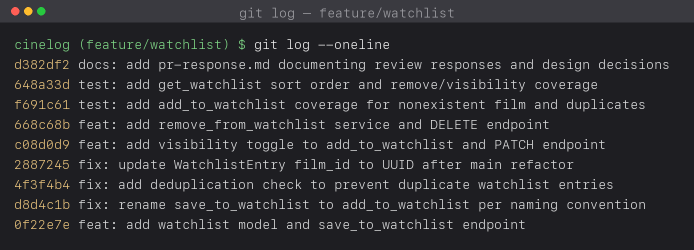

# PR Response Doc — CineLog Watchlist Feature

## AI Usage
I used AI in four ways: (1) to summarize `services/collection_service.py` and `tests/test_collection.py` before I touched the watchlist code, so I could follow existing patterns; (2) to sanity-check that my watchlist test shape matched `tests/test_collection.py`; (3) as a devil's advocate on my Comment 4 and Comment 5 design arguments — I wrote each response first, then asked what counterargument a careful reviewer would raise; and (4) to verify the final commit history followed conventional-commit format.

Two changes came out of the devil's-advocate pass. For Comment 4, the AI pointed out that "public is good for discovery" is generic, so I grounded the argument in CineLog's specific identity as a *community* app and added the mitigation (the per-entry visibility toggle). For Comment 5, re-reading the maintainer's comment made me realize their point ("most users want to see what they added recently") actually *supports* date-added ordering — the same order I chose — so I rewrote my response from a (mistaken) disagreement into an explicit agreement plus a synthesis for long lists. The reasoning and the CineLog-specific framing are my own.

## Comment 1 — Rename
**What I did:**
I renamed the service function `save_to_watchlist()` to `add_to_watchlist()` to match the project's `add_to_collection()` naming, and updated its one call site in `routes/watchlist/watchlist.py` (both the import and the call).
**How I verified:**
I searched the whole project for both names with `rg -n "save_to_watchlist|add_to_watchlist" -S .`. The only references to the old name were the service definition and the route import/call; after the change, `save_to_watchlist` returns no matches anywhere and the suite still passes. The rename is its own commit (`fix: rename save_to_watchlist to add_to_watchlist per naming convention`).

## Comment 2 — Deduplication
**What I did:**
I added the same pre-insert duplicate check that `add_to_collection()` uses: before creating the entry, query `WatchlistEntry` by `user_id` and `film_id`; if a row already exists, raise `AlreadyInWatchlistError` instead of inserting. The route maps that exception to HTTP 409. The `WatchlistEntry` table also carries a `UniqueConstraint("user_id", "film_id")`, so the database backs up the service-level guard.
**How I verified:**
I read `add_to_collection()` in `services/collection_service.py` first and mirrored its `filter_by(...).first()` → raise pattern. I then added `test_add_to_watchlist_duplicate_raises`, which asserts the second add raises `AlreadyInWatchlistError` and that exactly one row exists, and ran the full suite.

## Comment 3 — Missing test
**What I did:**
I created `tests/test_watchlist.py`, modeled directly on `tests/test_collection.py` (same `app` / `sample_user` / `sample_film` fixtures and assertion style). The required test is `test_add_to_watchlist_nonexistent_film_raises`, the direct equivalent of `test_add_to_collection_nonexistent_film_raises`: it calls `add_to_watchlist` with a `film_id` that isn't in the database and asserts `FilmNotFoundError` is raised, rather than a database integrity error.
**How I verified:**
I ran `python -m pytest tests/test_watchlist.py -v` and then `python -m pytest tests/ -v`; all 12 tests pass.

## Comment 4 — Default visibility
**My position:**
Keep `public=True` as the default.
**Reasoning:**
CineLog is described as a *community film tracking app* — its value is people seeing what other people are watching and want to watch. In that context the default is not a neutral convenience choice; it decides whether the community surface is populated at all. If watchlists default to private, the common flow (add a film, move on) contributes nothing to the shared feed, and the social features only work for the minority of users who go find a setting and flip it. Public-by-default means the ordinary act of adding a film seeds discovery, which is the behavior the product is built around.
**Tradeoff acknowledged:**
The cost is real: public-by-default exposes a user's taste before they consciously opt in, which is the wrong default for a privacy-first product. A private-by-default design optimizes for that — nothing is shared until the user chooses to share it. I still favor public-first *for CineLog specifically* because it is a community app rather than a private journal, and because the exposure is bounded: the per-entry `public` flag and the visibility-toggle endpoint let a user keep any individual film private without abandoning the feature. If CineLog later adds real accounts and privacy controls, the default is worth revisiting.

## Comment 5 — Sort order
**My position:**
Sort by `date_added` descending — which is a change from the original alphabetical ordering, toward what the maintainer suggested.
**Reasoning:**
A watchlist is a queue of intent, not a catalog. On CineLog the thing a user most often wants when they open their watchlist is "what did I just add that I'm planning to watch," so the most recently added items are the most actionable and belong at the top. Date-added also matches `get_collection()`, which already sorts newest-first, keeping one mental model across both features.
**Engagement with reviewer's point:**
The maintainer wrote that "most users want to see what they added recently," and I agree — that is exactly why I moved from alphabetical to `date_added` descending. Alphabetical ordering optimizes for *looking up a known title* in a long, catalog-like list; it actively buries the recency signal that makes a watchlist useful. Where the maintainer's point has a limit is very long watchlists, where scanning by title is genuinely easier — so rather than treat it as either/or, I'd keep `date_added` as the canonical server default (it preserves the user's latest intent) and, if list length becomes a problem, add an optional `sort=title` query parameter for client-driven alphabetical browsing. That keeps the default aligned with the maintainer's reasoning while leaving room for the case alphabetical was solving.

## Comment 6 — Rebase and conflict resolution
**What conflicted:**
My watchlist code was originally written against the pre-refactor schema, where `Film.id` was an integer — so `WatchlistEntry.film_id` was `db.Column(db.Integer, ...)`, and the service docstrings and the `POST /add` contract described an integer `film_id`. While the PR was open, a refactor merged to `main` migrating film IDs from integer to UUID (`Film.id` → `db.String(36)`). After I rebased `feature/watchlist` onto the updated `main`, the code applied without textual git markers (my watchlist lives in new files plus a model class appended to `models.py`), but it was semantically broken: `WatchlistEntry.film_id` was still an integer foreign key pointing at a now-UUID `film.id`, so it no longer matched the type it referenced.
**How I resolved it:**
I resolved it in a dedicated commit, `fix: update WatchlistEntry film_id to UUID after main refactor`, which changed `WatchlistEntry.film_id` to `db.String(36)` (keeping the `ForeignKey("film.id")`), and updated the service docstrings and the endpoint body contract from integer IDs to UUID strings. The watchlist entry's own `id` and `user_id` were already `String(36)` UUIDs, matching the other models, so only `film_id` needed migrating.
**How I verified no conflict remains:**
`git log --oneline main..HEAD` shows a linear history with no `Merge branch` commits. The test suite uses real generated UUIDs (`Film.id` and `User.id` default to `generate_uuid()`), and `test_add_to_watchlist_nonexistent_film_raises` passes a UUID-shaped id — all 12 tests pass, confirming the watchlist consistently uses UUID film IDs end to end.

## Stretch Features

**1. `remove_from_watchlist(user_id, film_id)`**
I implemented `remove_from_watchlist()` in `services/watchlist_service.py` following the same pattern as `remove_from_collection()`: query by `(user_id, film_id)`, raise `NotInWatchlistError` if no row exists, otherwise delete and commit, returning `True`. When the film isn't on the watchlist it raises `NotInWatchlistError` (mapped to HTTP 404 by `DELETE /watchlist/<user_id>/remove`) rather than failing silently. It is covered by `test_remove_from_watchlist_removes_entry` and `test_remove_from_watchlist_missing_entry_raises`.

**2. Extra edge-case test (not requested in the review)**
Beyond the required nonexistent-film test, I added `test_get_watchlist_returns_newest_first`. I chose the sort-order edge case deliberately because it is the one piece of watchlist behavior tied to a contested design decision (Comment 5 — `date_added` descending). A rename or a dedup check is self-evident from reading the code, but sort order is easy to regress silently during a future refactor, and it is exactly the behavior the maintainer questioned. Pinning it with a test turns my Comment 5 argument into an enforced contract, so the ordering can't drift without a test failing.

**3. Visibility toggle**
I added a `public` parameter to `add_to_watchlist()` (defaulting to `True`, per Comment 4) so callers can set visibility explicitly at creation time instead of relying on the default — e.g. `POST /watchlist/<user_id>/add` with body `{"film_id": "<uuid>", "public": false}`. I also added `update_watchlist_visibility()` and a `PATCH /watchlist/<user_id>/visibility` endpoint so visibility can be changed after the entry exists, covered by `test_update_watchlist_visibility_updates_flag` and `test_update_watchlist_visibility_endpoint`.

## PR Description
This PR adds a watchlist feature to CineLog. Users can add films they want to watch, view their watchlist through REST endpoints, remove entries, and control whether each entry is publicly visible. The implementation mirrors the collection feature's structure so the code stays consistent and easy to reason about.

Design decisions:
1. **Default visibility:** new watchlist entries default to `public=True`, because CineLog is a community app and the default determines whether the shared discovery surface gets populated at all. A per-entry `public` flag and a visibility endpoint let users override this.
2. **Sort order:** `get_watchlist()` returns entries by `date_added` descending (newest first), matching the collection feature and surfacing the user's most recent intent first.

Manual testing:
1. Create and activate a virtual environment, then `pip install -r requirements.txt`.
2. Run `python app.py` to start the API server at `http://127.0.0.1:5000`.
3. With a known `user_id` and `film_id` (a UUID), `POST /watchlist/<user_id>/add` with JSON `{"film_id":"<uuid>"}` and confirm a 201 with the new entry.
4. `GET /watchlist/<user_id>` and confirm the new film appears first in the list.
5. Repeat the add request with the same `film_id` and confirm the API returns a 409 duplicate error.
6. `POST /watchlist/<user_id>/add` with `{"film_id":"<uuid>","public":false}` (a different film) and confirm the entry is created with `public: false`.
7. `PATCH /watchlist/<user_id>/visibility` with `{"film_id":"<uuid>","public":false}` and confirm the `public` flag changes.
8. `DELETE /watchlist/<user_id>/remove` with `{"film_id":"<uuid>"}` and confirm the entry is removed.
9. Run `python -m pytest tests/ -v` to verify the full suite passes.

## Git History

`git log --oneline` on `feature/watchlist` (relative to `main`), newest first — a linear, conventional history with no merge commits, one logical change per commit:

```text
docs: add git log screenshot
docs: add pr-response.md documenting review responses and design decisions
test: add get_watchlist sort order and remove/visibility coverage
test: add add_to_watchlist coverage for nonexistent film and duplicates
feat: add remove_from_watchlist service and DELETE endpoint
feat: add visibility toggle to add_to_watchlist and PATCH endpoint
fix: update WatchlistEntry film_id to UUID after main refactor
fix: add deduplication check to prevent duplicate watchlist entries
fix: rename save_to_watchlist to add_to_watchlist per naming convention
feat: add watchlist model and save_to_watchlist endpoint
```

Screenshot of `git log --oneline` (with short hashes):



> The message list above is a text fallback; the screenshot is the rubric deliverable. (A `git log` screenshot cannot include the commit that adds the screenshot itself — that is inherent.)
